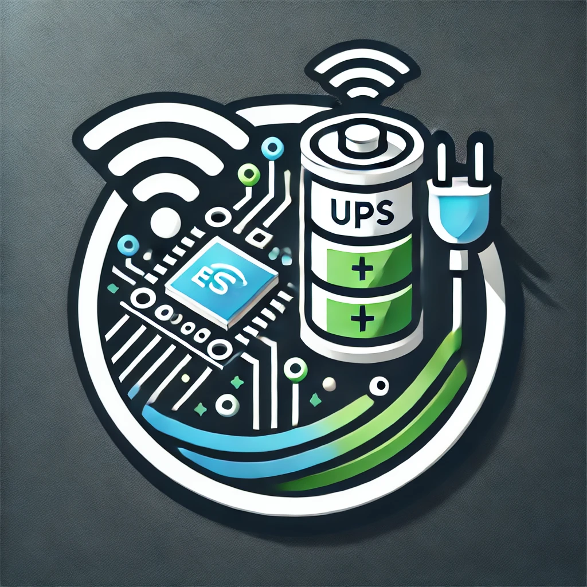

<p align="center">
  <a href="" rel="noopener">
 </a>
</p>

<h3 align="center">UPS ESP32-S3 Server — MQTT / WiFi (Ragtech Protocol)</h3>

<div align="center">

[]()
[](https://github.com/antunesls/UPS_ESP32_tinySrv/issues)
[](https://github.com/antunesls/UPS_ESP32_tinySrv/pulls)
[](https://github.com/antunesls/UPS_ESP32_tinySrv/releases)
[](/LICENSE)

</div>

---

<p align="center">
Monitoramento moderno para nobreaks Ragtech via USB-CDC no ESP32-S3. <br>
Publica métricas, alarmes em MQTT com integração ao Home Assistant, e oferece painel web completo com OTA.<br>
<i>Projeto criado e otimizado originalmente para a linha <b>Easy Pro 1200</b>.</i>
</p>

---

## 🔍 Sobre o projeto

O **UPS ESP32-S3 Server** centraliza o monitoramento do seu nobreak Ragtech (originalmente projetado e testado exhaustivamente na linha **Easy Pro 1200**) ao conectá-lo a um ESP32-S3 via interface USB CDC/ACM. 

O sistema atua de forma independente:
- Comunica-se com o UPS usando o protocolo proprietário da Ragtech
- Lê dezenas de registradores essenciais (tensão, corrente, carga, bateria, temperatura)
- Processa 22 flags de status (modo bateria, sobrecarga, falha no inversor, bateria fraca, etc.)
- Integra-se de forma 100% autônoma ao **Home Assistant** via MQTT Auto-Discovery
- Apresenta um **Painel Web Responsivo** para monitoramento local e atualizações via ar (OTA)

### Hardware Suportado

- **Nobreak:** Ragtech Easy Pro 1200 (e outras famílias compatíveis com USB CDC `0x04D8:0x000A`)
- **Placa Controladora:** ESP32-S3 (Testado com YD-ESP32-S3 com LED RGB WS2812 no GPIO 48). Recomenda-se modelo com 8 MB de flash.

---

## ✨ Principais Recursos e Funcionalidades

📊 **Métricas Analógicas Detalhadas**
- Tensão de entrada e de saída
- Corrente de saída e Percentual de carga
- Potência de entrada/saída (W) e Energia Acumulada no tempo (kWh) com persistência em memória NVS
- Temperatura interna e Frequência
- Tensão e capacidade (%) da bateria

⚠️ **Monitoramento de Alarmes e Status (22 Flags)**
- Status operacionais: `op_battery`, `op_stand_by`, `op_warning`, `no_v_input`, `lo_v_input`, etc.
- Detecção de anomalias: `fail_overload`, `fail_inverter`, `fail_shortcircuit`, `fail_overtemp`, `lo_battery`, etc.

🏠 **Integração Nativa com Home Assistant**
- **MQTT Auto-Discovery:** Todos os sensores analógicos (`sensor`) e de estado (`binary_sensor`) aparecem automaticamente na dashboard do HA, sem necessidade de configuração manual em arquivos YAML. Identificação única via MAC Address.

🌐 **Painel Web Status & Controle (Web UI)**
- Dashboard em tempo real atualizada a cada 5s.
- Badges coloridos intuitivos para os status e alarmes ativos (verde = ok, amarelo = alerta, vermelho = erro).
- Visualizador de logs do sistema nativo no browser.
- Interface para **Atualização Remota (OTA)** segura e fácil via arquivo `.bin`.

⚙️ **Gerenciamento de Rede (Captive Portal)**
- Inicialização inteligente via Hotspot WiFi (`UPS-ESP32-XXXXXX` na cor Magenta).
- Configure sua rede doméstica acessando `http://192.168.4.1` na primeira inicialização.
- Opção rápida para redefinir as credenciais segurando o botão de BOOT por 3 segundos.

💡 **Sinalização Visual Inteligente**
- Suporte a LED WS2812 embutido na placa.
- Diferentes cores e padrões para indicar estados: Inicialização (Amarelo), Wi-Fi (Azul Rápido), MQTT (Azul Lento), Conectando ao UPS (Laranja), Tudo OK (Verde Fixo), Alerta OTA (Ciano), Configuração AP (Magenta) e Falhas (Vermelho).

---

## 🚀 Primeiros Passos

### Pré-requisitos

- ESP-IDF v5.5+ (para compilação local)
- ESP32-S3 (8MB de flash recomendado para partições duplas de OTA)
- Nobreak Ragtech com porta USB e suporte a CDC

### Instalação Rápida (Binário)

Esta é a maneira mais simples de rodar direto:

1. Baixe o arquivo `UPS_ESP32_tinySrv.bin` localizado na aba de [Releases](https://github.com/antunesls/UPS_ESP32_tinySrv/releases).
2. Conecte o ESP32-S3 ao PC e execute via `esptool`:

```bash
esptool.py --chip esp32s3 --port /dev/ttyUSB0 --baud 460800 write_flash 0x0 UPS_ESP32_tinySrv.bin
```
*(As imagens pré-compiladas já contém bootloader, partition table e app de modo unificado).*

### Compilando do Código Fonte

Para desenvolvedores que desejam customizar a firmware:

```bash
git clone https://github.com/antunesls/UPS_ESP32_tinySrv.git
cd UPS_ESP32_tinySrv
idf.py set-target esp32s3
idf.py menuconfig   # Configure MQTT, Wi-Fi (se desejar chumbado), GPIO do LED, etc.
idf.py build flash monitor
```

**Principais configurações no `menuconfig`:**
- **UPS Configuration:** Tipo de família do UPS.
- **MQTT Configuration:** Broker IP, Porta, Usuário e Senha.
- **LED Configuration:** Pino GPIO direcionado para o WS2812.

---

## 🗂️ Tópicos MQTT (Sub/Pub)

O sistema publica utilizando o Endereço MAC do ESP32 para garantir unicidade na rede.

```text
UPS_ESP32_tinySrv/<MAC>/availability            -> Estado "online"/"offline"
UPS_ESP32_tinySrv/<MAC>/Sensor_<chave>          -> Valor métrico 
UPS_ESP32_tinySrv/<MAC>/status/<flag>           -> Estado ON ou OFF
homeassistant/sensor/.../config                 -> Payload de auto-discovery
homeassistant/binary_sensor/.../config          -> Payload de auto-discovery
```

---

## 🗃️ Estrutura do Código Fonte

O projeto está modularizado de acordo com melhores práticas ESP-IDF:
- `main.c` — Ponto de entrada / inicialização geral.
- `ups.c/.h` — Conexão USB CDC Host, requisições hexadecimais, engine de decodificação Ragtech.
- `web_server.c/.h` e `web_ui.h` — Servidor HTTP, endpoints REST (`/api/metrics`, `/api/status`) e interface estática.
- `ups_mqtt.c/.h` — Handler de publicação e registro Mqtt Discovery.
- `wifi_manager.c/.h` — Configuração AP Automática, NVS e reconnect.
- `led_status.c/.h` — Driver de sinalização RGB (WS2812).

---

## 👨‍💻 Autores & Agradecimentos

Projeto mantido e desenvolvido por [@antunesls](https://github.com/antunesls).

*Referências notáveis para a decodificação do protocolo:*
- [@RafaelEstevamReis/HA_Ragtech_UPS](https://github.com/RafaelEstevamReis/HA_Ragtech_UPS)

